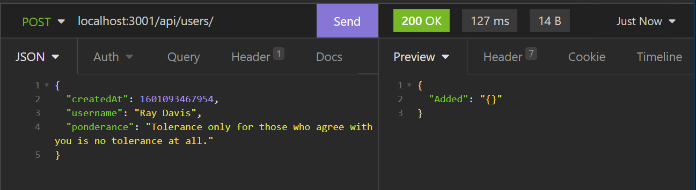

# aws-firstGo
   

### Screenshot Examples of essential AWS configuration syntax  
#### - (Alongside Express)  
> 
>   
> 
 
   

### Screenshot Examples of basic insomnia request/response
> 
> 
>  

